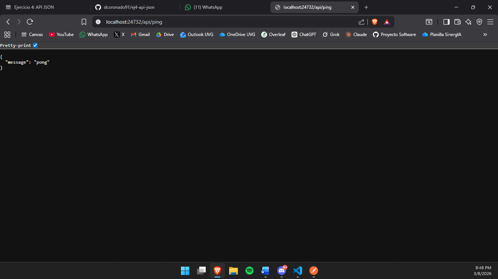
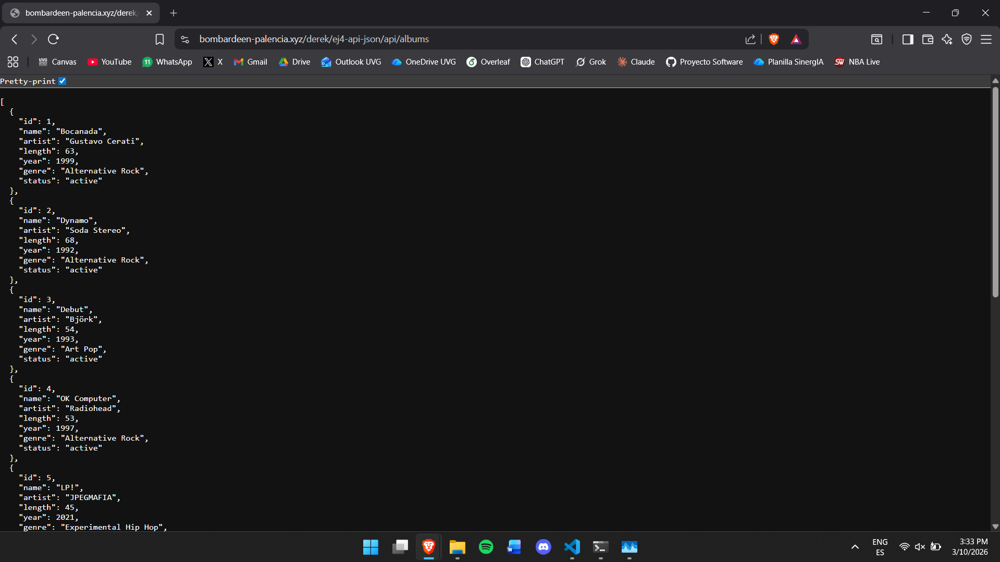
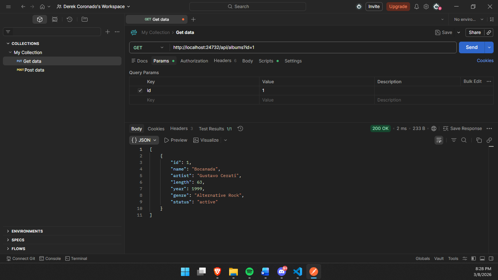
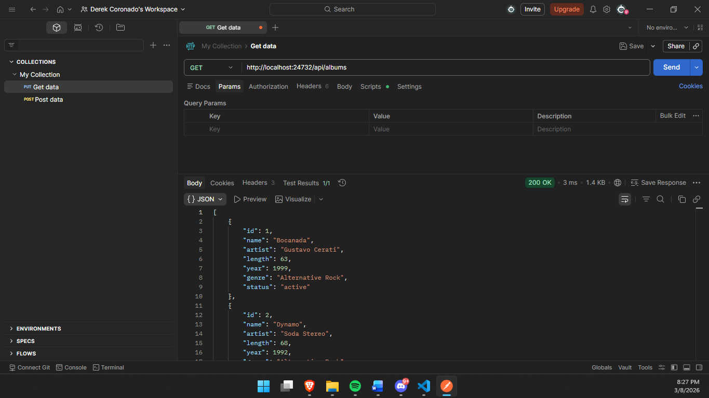
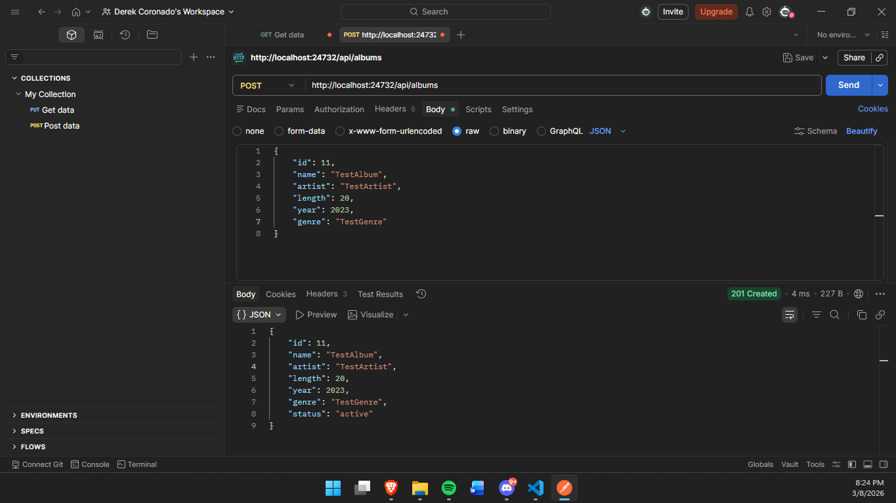
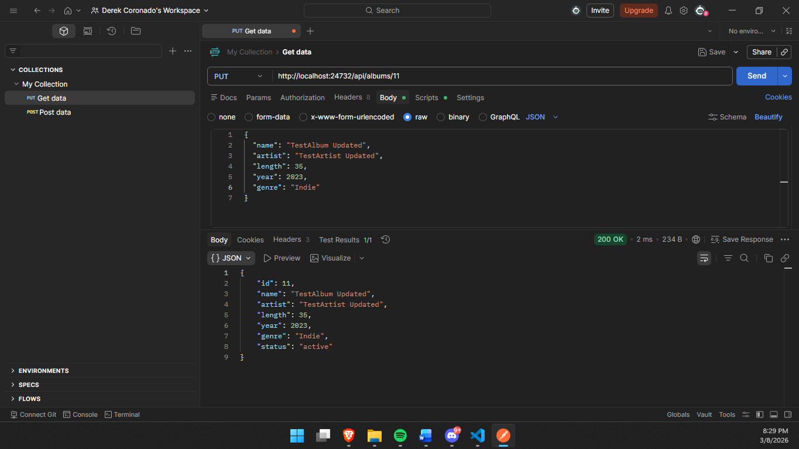
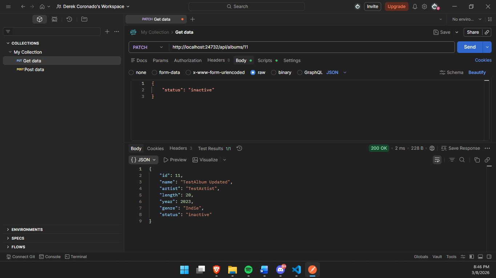
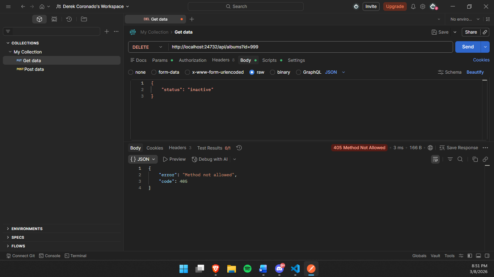
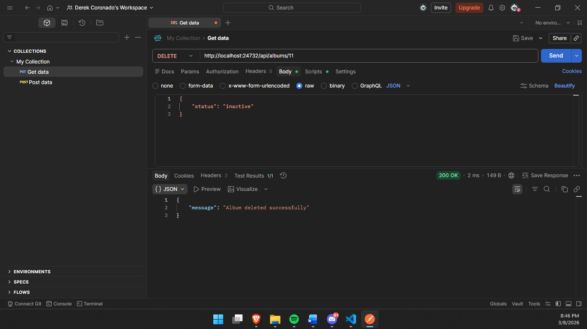
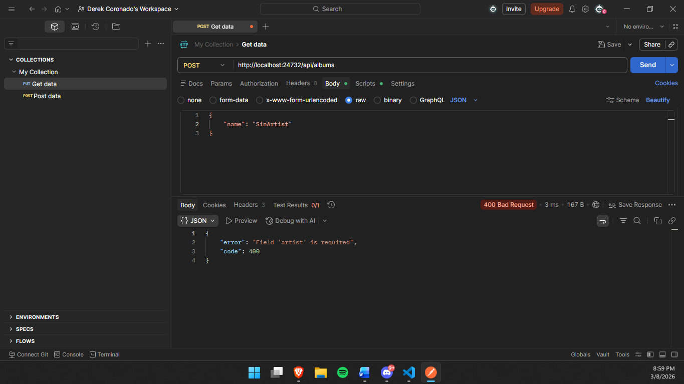

# Albums JSON API

API REST construida en Go (librería estándar) para gestionar una colección de álbumes musicales.

> **🔗 API en vivo:** https://bombardeen-palencia.xyz/derek/ej4-api-json/api/ping

## Tema

Colección de álbumes de música. Cada álbum contiene: `id`, `name`, `artist`, `length` (duración en minutos), `year`, `genre` y `status`.

## Ejecución

```bash
go run main.go
```

O con Docker:

```bash
docker compose up
```

El servidor escucha en el puerto **24732**.

## Estructura del proyecto

```
.
├── main.go
├── Dockerfile
├── docker-compose.yml
├── README.md
├── data/
│   └── albums.json
└── docs/
    └── screenshots/
```

---

## Endpoints

### `GET /api/ping`
Verifica que el servidor esté activo.

### `GET /api/albums`
Retorna todos los álbumes. Soporta múltiples filtros combinables:

| Query param | Descripción | Ejemplo |
|---|---|---|
| `id` | Filtrar por ID exacto | `?id=1` |
| `genre` | Filtrar por género | `?genre=Alternative Rock` |
| `artist` | Filtrar por artista | `?artist=Radiohead` |
| `year` | Filtrar por año | `?year=1997` |

### `GET /api/albums/{id}`
Retorna un álbum por su ID (path parameter).

### `POST /api/albums`
Crea un nuevo álbum. Campos requeridos: `name`, `artist`, `genre`, `year`, `length`.

### `PUT /api/albums/{id}`
Reemplaza completamente un álbum existente.

### `PATCH /api/albums/{id}`
Actualización parcial: solo se modifican los campos enviados.

### `DELETE /api/albums/{id}`
Elimina un álbum.

### Respuestas de error
Todos los errores retornan JSON estructurado:
```json
{"error": "Album not found", "code": 404}
```

---

## Evidencia de pruebas

### Servidor corriendo localmente en el puerto 24732


### Servidor corriendo en el server


### GET — Query parameter `?id=1`


### GET — Path parameter `/api/albums/{id}`


### POST — Crear álbum


### PUT — Reemplazar álbum


### PATCH — Actualización parcial


### DELETE — Eliminar álbum (request)


### DELETE — Method Not Allowed


### Error — 404 Not Found


### Error — 400 Bad Request

